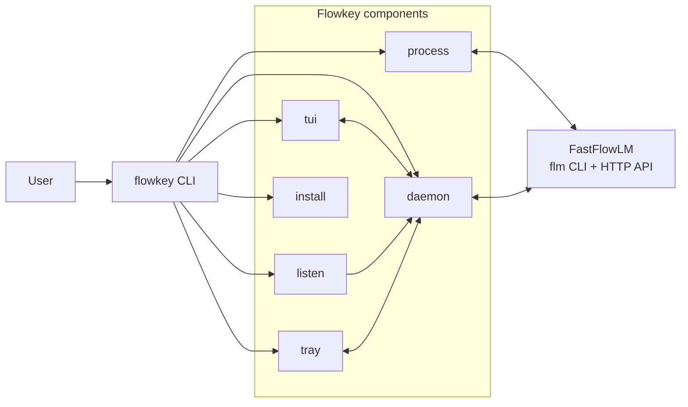

# Flowkey

Flowkey is a Linux desktop assistant for [FastFlowLM](https://github.com/FastFlowLM/FastFlowLM): one `flowkey` command gives you global hotkeys, clipboard-driven text transforms, a streaming TUI chat, a multi-pane dashboard, notes, and tray controls on top of the local FLM runtime.

Forked from [agr77one/Fastflow](https://github.com/agr77one/Fastflow).

## Features

- **Global hotkeys** - Select text anywhere, press a shortcut, and Flowkey rewrites it in place with grammar, summarize, explain, prompt, or tone modes.
- **Clipboard watcher** - Optional background hints for copied URLs, code, and stack traces.
- **Streaming TUI chat** - Chat with the local model from a terminal UI with slash commands and conversation history.
- **Dashboard** - Inspect runtime status, telemetry, benchmarks, notes, hotkeys, model settings, and input-processing controls.
- **System tray** - Start or stop the daemon, toggle performance mode, and open the TUI from the tray.
- **Standalone text processing** - Use `flowkey process` directly for one-off transforms without the full UI.
- **Notes capture** - Save selections into your notes vault with a hotkey.
- **Local-first runtime control** - Manage the FLM server, model selection, and startup behavior from Flowkey itself.

## Requirements

### FLM Runtime

Flowkey is a frontend for FastFlowLM, not a replacement for it. Install FLM first:

- FastFlowLM GitHub: <https://github.com/FastFlowLM/FastFlowLM>
- Linux getting started guide: <https://github.com/FastFlowLM/FastFlowLM/blob/main/linux-getting-started.md>

### Linux dependencies

Base system tools such as `python3`, `git`, and a working desktop session are assumed. The non-obvious runtime dependencies are:

- **X11-oriented**
  - `xdotool` for window awareness and paste-back helpers
  - `libnotify` / `libnotify-bin` for desktop notifications

- **Wayland-oriented**
  - `ydotool` for paste-back
  - `wl-clipboard` for clipboard access
  - `libnotify` / `libnotify-bin` for desktop notifications

### Python dependencies

The release binary bundles its Python dependencies. For source or development installs, Flowkey uses:

| Dependency | Purpose |
|---|---|
| `packaging` | Version parsing and comparisons |
| `pyperclip` | Clipboard access |
| `textual` | Terminal UI framework |
| `pynput` | X11 hotkey capture |
| `evdev` | Wayland hotkey capture |
| `dasbus` | Wayland tray/status notifier integration |
| `pystray` | X11 tray icon |
| `trafilatura` | Optional webpage readability extraction |

Development installs also use `build`, `pyinstaller`, `pytest`, and `ruff` from the `dev` extra.

## Installation

### Official release install

Use the installer script for the deployed binary release:

```bash
curl -fsSL https://raw.githubusercontent.com/jpnski/flowkey-linux/main/install.sh | bash
```

What it does:

- downloads the matching Linux release tarball
- installs the payload under `~/.local/opt/flowkey/current`
- links `flowkey` into `~/.local/bin`
- installs the desktop entry, udev rule, and other system setup pieces when available
- runs `flowkey install` to seed config and pull the default model if needed

If you already downloaded the script locally, you can run it directly with `bash install.sh`.

### Development install

Clone the source and run the components from the checkout:

```bash
git clone https://github.com/jpnski/flowkey-linux.git
cd flowkey-linux
python3 -m venv .venv
source .venv/bin/activate
pip install -e .[dev]
```

Run the individual pieces directly from the repo:

```bash
python scripts/flowkey.py daemon
python scripts/flowkey.py listen
python scripts/flowkey.py tui
python scripts/flowkey.py install
python scripts/flowkey.py process --mode grammar --input-file /dev/stdin
```

If the editable install is active, the single `flowkey` command is also available:

```bash
flowkey daemon
flowkey listen
flowkey tui
flowkey install
flowkey process --mode grammar --input-file /dev/stdin
```

## Configuration

Flowkey uses a single `config.json`, but the path depends on how it is launched:

| Mode | Config location | Runtime data | Logs |
|---|---|---|---|
| Dev checkout | `./config.json` | `./data/` | `./logs/` |
| Deployed binary | `~/.local/share/Flowkey/config.json` | `~/.local/share/Flowkey/data/` | `~/.local/share/Flowkey/logs/` |

The TUI manages the common settings most users touch often: model selection, hotkeys, performance mode, autostart, and input-processing options. The same file also stores lower-level values such as the FLM server URL, request timeout, chunking thresholds, and other defaults that are usually left alone.

## Architecture



## Project Structure

```text
flowkey-linux/
├── install.sh
├── flowkey.spec
├── pyproject.toml
├── README.md
├── TODO.md
├── scripts/
│   ├── flowkey.py
│   ├── build_frozen.py
│   ├── launcher.py
│   ├── install.py
│   ├── daemon.py
│   ├── listener.py
│   ├── tray.py
│   ├── engine.py
│   ├── config.py
│   ├── paths.py
│   ├── flm_server.py
│   ├── llm_client.py
│   ├── notes.py
│   ├── telemetry.py
│   ├── pull.py
│   ├── notify.py
│   ├── subprocess_util.py
│   ├── updater.py
│   ├── tools.py
│   └── tui/
│       ├── app.py
│       ├── chat.py
│       └── dashboard/
└── tests/
```

## License

MIT. See [LICENSE](LICENSE).
