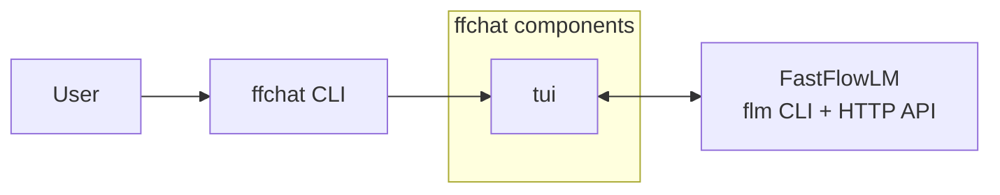

# ffchat

ffchat is a Linux TUI chat frontend for [FastFlowLM](https://github.com/FastFlowLM/FastFlowLM): one `ffchat` command gives you a streaming chat interface with configurable slash commands, direct FLM server lifecycle management, and a simplified configuration dashboard.

Forked from [agr77one/Fastflow](https://github.com/agr77one/Fastflow).

## Features

- **Streaming TUI chat** - Chat with the local model from a terminal UI with configurable slash commands (grammar, summarize, explain, prompt).
- **Direct FLM server management** - TUI manages FLM server lifecycle directly without daemon processes or background services.
- **Config dashboard** - Inspect runtime status, model settings, and configuration options in a single tab.
- **Local-first** - Manage the FLM server, model selection, and startup behavior from ffchat itself.
- **Simple installation** - Install via `pip install .` with no system packages or sudo required.

## Requirements

### FLM Runtime

Flowkey is a frontend for FastFlowLM, not a replacement for it. Install FLM first:

- FastFlowLM GitHub: <https://github.com/FastFlowLM/FastFlowLM>
- Linux getting started guide: 
<https://github.com/FastFlowLM/FastFlowLM/blob/main/docs/linux-getting-started.md>

### Linux dependencies

Base system tools such as `python3`, `git`, and a working desktop session are assumed. The non-obvious runtime dependencies are:

- **X11-oriented**
  - `xdotool` for window awareness and paste-back helpers
  - `libnotify` / `libnotify-bin` for desktop notifications

- **Wayland-oriented**
  - `ydotool` for key simulation and paste-back
  - `wl-clipboard` for clipboard access
  - `libnotify` / `libnotify-bin` for desktop notifications

### Python dependencies

The release binary bundles its Python dependencies. For source or development installs, Flowkey uses:

| Dependency | Purpose |
|---|---|
| `packaging` | Version parsing and comparisons |
| `pyperclip` | Clipboard access |
| `textual` | Terminal UI framework |
| `pynput` | X11 hotkey capture |
| `evdev` | Wayland hotkey capture |
| `dasbus` | Wayland tray/status notifier integration |
| `pystray` | X11 tray icon |
| `trafilatura` | Optional webpage readability extraction |

Development installs also use `build`, `pyinstaller`, `pytest`, and `ruff` from the `dev` extra.

## Installation

### Development install

Clone the source and run the components from the checkout:

```bash
git clone https://github.com/jpnski/flowkey-linux.git
cd flowkey-linux
python3 -m venv .venv
source .venv/bin/activate
pip install -e .[dev]
```

Run the TUI directly from the repo:

```bash
python scripts/ffchat.py
```

If the editable install is active, the single `ffchat` command is also available:

```bash
ffchat
```

## Usage

The TUI provides:

- **Chat interface** - Send messages to the local FLM model with streaming responses
- **Config dashboard** - Configure model selection, FLM server settings, and other options
- **Slash commands** - Built-in commands like `/grammar`, `/summarize`, `/explain`, and `/prompt` for common text operations

Keyboard shortcuts:

- **F1** - Switch to Chat tab
- **F2** - Switch to Config tab
- **Ctrl+C** - Quit (press twice within 3 seconds)

## Configuration

Flowkey uses a single `config.json`, but the path depends on how it is launched:

| Mode | Config location | Runtime data | Logs |
|---|---|---|---|
| Dev checkout | `./config.json` | `./data/` | `./logs/` |
| Deployed binary | `~/.local/share/Flowkey/config.json` | `~/.local/share/Flowkey/data/` | `~/.local/share/Flowkey/logs/` |

The TUI manages the common settings most users touch often: model selection, hotkeys, performance mode, autostart, and input-processing options. The same file also stores lower-level values such as the FLM server URL, request timeout, chunking thresholds, and other defaults that are usually left alone.

### Hotkeys

Flowkey separates hotkeys into two user-facing groups so their behavior stays predictable:

| Group | What it does | User flow |
|---|---|---|
| `transform_hotkeys` | `grammar`, `prompt`, `summarize`, `explain`, `tone` | Flowkey captures the current selection, runs the selected transform, then pastes the result back into the original app. If the selected text starts with a mode prefix like `prompt:` or `explain:`, that mode is used instead. |
| `interaction_hotkeys` | `open_chat`, `ask_chat`, `capture_note` | Flowkey launches the TUI chat, sends the current selection to chat, or saves text into notes. These actions do not replace text in place. |

From the user perspective:

- Transform hotkeys are for editing text in place. Select text anywhere, press the hotkey, and Flowkey copies the selection, runs the transform, and pastes the rewritten text back.
- Interaction hotkeys are for moving text into another Flowkey surface. `open_chat` brings up the TUI, `ask_chat` sends the selection to chat, and `capture_note` stores the selection as a note.
- The same hotkeys are editable in the TUI Config pane, so you can choose bindings that fit your desktop and keyboard layout.
- The TUI launcher uses `terminal` from `config.json` when set, otherwise it falls back to a suitable installed terminal emulator.

## Architecture



## Project Structure

```text
flowkey-linux/
├── pyproject.toml
├── README.md
├── TODO.md
├── scripts/
│   ├── ffchat.py
│   ├── engine.py
│   ├── config.py
│   ├── paths.py
│   ├── flm_server.py
│   ├── llm_client.py
│   ├── pull.py
│   ├── benchmark.py
│   └── tui/
│       ├── app.py
│       ├── chat.py
│       └── dashboard/
└── tests/
```

## License

MIT. See [LICENSE](LICENSE).
